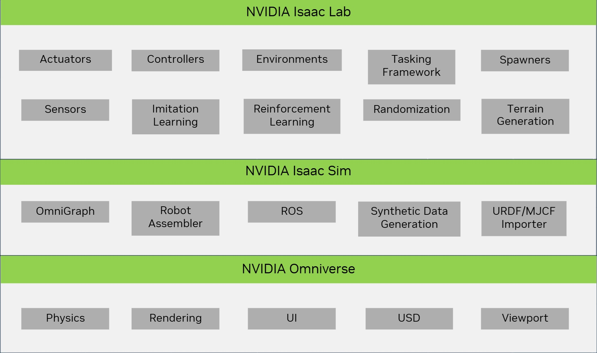

# Isaac Lab 2.2.0 系统架构与训练仿真策略代码分析

---

## 一、前言

在上一篇文章 [《00-Isaac Lab 2.2.0 --- 安装配置与案例代码分析》]() 中，已经完成了：

- Isaac Lab 的安装与配置  
- 官方示例的运行与验证

**Isaac Lab 官方仓库已完整内置了宇树全系列机器人的运动仿真控制用例**，可直接开展强化学习训练。本文将聚焦：  
> - Isaac Lab 2.2.0 系统架构介绍
> - 如何基于 Isaac Lab 2.2.0 高效完成宇树机器人的强化学习训练与仿真运行。

---

## 二、Isaac Lab 强化学习系统架构

> 以下架构图展示了 NVIDIA Isaac 全栈生态关系



### 2.1 NVIDIA Omniverse
- **定位**：工业级仿真 & 3D 计算底座  
- **关键能力**  
  - **Physics**：高精度动力学（碰撞、摩擦、重力）  
  - **Rendering**：光线追踪级 3D 渲染  
  - **USD**：Pixar Universal Scene Description 统一资产格式  
  - **Viewport**：实时 3D 预览窗口  

### 2.2 NVIDIA Isaac Sim
- **定位**：高保真机器人仿真平台（构建于 Omniverse 之上）  
- **核心组件**  
  - OmniGraph：节点化行为编辑器  
  - Robot Assembler：模块化机器人装配  
  - ROS1/2 Bridge：零成本对接 ROS 生态  
  - Synthetic Data Generator：为 AI 训练批量生成标注数据  
  - URDF/MJCF Importer：一键导入外部机器人模型  

### 2.3 NVIDIA Isaac Lab
- **定位**：面向机器人强化学习的专用框架（基于 Isaac Sim）  
- **关键模块**  
  | 模块 | 职责 |
  | --- | --- |
  | Actuators | 关节/驱动底层控制 |
  | Controllers | 高级控制算法（PID、MPC） |
  | Environments | 训练&测试场景 |
  | Tasking Framework | 任务目标定义 |
  | Spawners | 动态生成机器人/物体 |
  | Sensors | 相机、LiDAR 等仿真 |
  | Imitation Learning | 行为克隆、GAIL |
  | Reinforcement Learning | 奖励函数、状态空间设计 |
  | Randomization | 领域随机化 |
  | Terrain Generation | 程序化地形 |

---

## 三、Isaac Lab 代码结构

```text
IsaacLab
├── .vscode                  # VS Code 调试/格式化配置
├── .flake8                  # Python 代码风格检查配置
├── CONTRIBUTING.md          # 贡献指南
├── CONTRIBUTORS.md          # 贡献者名单
├── LICENSE                  # 开源协议
├── isaaclab.bat             # Windows 启动脚本
├── isaaclab.sh              # Linux/Mac 启动脚本
├── pyproject.toml           # Python 项目配置文件
├── README.md                # 项目说明文档
├── docs                     # API 文档与教程
├── docker                   # 容器化部署配置
├── source                   # 核心源码
│   ├── isaaclab             # 框架主入口
│   ├── isaaclab_assets      # 机器人/场景资产
│   ├── isaaclab_mimic       # 模仿学习模块
│   ├── isaaclab_rl          # 强化学习算法
│   └── isaaclab_tasks       # 任务环境定义
├── scripts                  # 可执行脚本
│   ├── benchmarks           # 算法性能基准测试
│   ├── demos                # 功能演示脚本
│   ├── environments         # 预置仿真环境
│   ├── imitation_learning   # 模仿学习训练脚本
│   ├── reinforcement_learning # 强化学习训练脚本
│   ├── tools                # 数据处理/可视化工具
│   ├── tutorials            # 入门教程示例
├── tools                    # 开发工具集
└── VERSION                  # 版本信息文件
```

---

## 四、Isaac Lab 机器强化学习完整流程


1. **Asset Input**  
   - Scene Assets：仿真场景资源  
   - Robot Assets：`.usd` / `.urdf` 机器人模型  

2. **Configuration**  
   - Asset Config：关节、传感器参数  
   - Scene Config：物理属性、重力、碰撞  

3. **Design Task**  
   - 明确任务目标（行走、避障、抓取……）

4. **Register Env**  
   - 通过 [Gymnasium](https://gymnasium.farama.org/) 注册标准化环境

5. **Wrap Env**  
   - Learning Framework Wrapper（对接 SB3、RLlib）  
   - Video Wrapper（训练可视化）  
   - Wrapper API（统一接口）

6. **Run Training**  
   - Single-GPU / Multi-GPU / Multi-Node / Cloud

7. **Test Model**  
   - 性能评估 & 泛化测试

> 后续文章将对上述步骤逐一展开实战。

---

## 五、基于 Manager-Based 的强化学习环境

Isaac Lab 提供两种环境风格：

| 类型 | 特点 |
| --- | --- |
| **Manager-Based** | 模块化、易扩展（宇树全系列采用） |
| **Direct** | 轻量级、代码扁平化 |

### Manager-Based 环境组件

| 组件 | 说明 |
| --- | --- |
| **Interactive Scene** | Objects / Articulation / Sensors |
| **Event Manager** | 域随机化、外部扰动 |
| **Action Manager** | 关节空间 / 任务空间 / 自定义 |
| **Observation Manager** | 本体感知 / 外部感知 / 自定义 |
| **Command Manager** | Pose / Velocity / 自定义高级指令 |
| **Curriculum Manager** | 渐进式难度 |
| **Reward Manager** | 奖励塑形 |
| **Termination Manager** | 终止条件 |
| **Learning Agent** | 训练循环的核心驱动 |

---

## 六、宇树系列机器人在 Isaac Lab 中的资源

官方已内置全部宇树机器人模型与配置文件：

- 目录索引  
  [source/isaaclab_tasks/.../g1/](https://github.com/isaac-sim/IsaacLab/tree/main/source/isaaclab_tasks/isaaclab_tasks/manager_based/locomotion/velocity/config/g1)

- 关键文件  
  - `flat_env_cfg.py`：平坦地形环境配置  
  - `rough_env_cfg.py`：复杂地形环境配置  
  - `__init__.py`：Gymnasium 环境注册入口

### 6.1 `flat_env_cfg.py` 核心片段

```python
@configclass
class G1FlatEnvCfg(G1RoughEnvCfg):
    def __post_init__(self):
        super().__post_init__()
        # 地形设置为平坦
        self.scene.terrain.terrain_type = "plane"
        self.scene.terrain.terrain_generator = None
        self.scene.height_scanner = None
        self.observations.policy.height_scan = None
        self.curriculum.terrain_levels = None

        # 奖励权重调整
        self.rewards.track_ang_vel_z_exp.weight = 1.0
        self.rewards.lin_vel_z_l2.weight = -0.2
        ...
```

### 6.2 预注册环境（`__init__.py`）

```python
gym.register(
    id="Isaac-Velocity-Flat-G1-v0",
    entry_point="isaaclab.envs:ManagerBasedRLEnv",
    kwargs={
        "env_cfg_entry_point": f"{__name__}.flat_env_cfg:G1FlatEnvCfg",
        "rsl_rl_cfg_entry_point": f"{agents.__name__}.rsl_rl_ppo_cfg:G1FlatPPORunnerCfg",
        "skrl_cfg_entry_point": f"{agents.__name__}:skrl_flat_ppo_cfg.yaml",
    },
)
```

### 6.3 一键训练 & 仿真

| 阶段 | 命令（Windows） |
| --- | --- |
| **训练** | `isaaclab.bat -p scripts/reinforcement_learning/rsl_rl/train.py --task=Isaac-Velocity-Flat-G1-v0 --headless` |
| **仿真** | `isaaclab.bat -p scripts/reinforcement_learning/rsl_rl/play.py --task=Isaac-Velocity-Flat-G1-Play-v0` |

> 使用 `...-Play-v0` 可避免加载冗余资源，加速可视化。

---

## 七、总结

- ✅ Isaac Lab 已**完全集成**宇树全系列机器人  
- ✅ 提供 **Manager-Based** 模块化 RL 环境，易扩展  
- ✅ **Windows / Linux / 云** 全平台支持  

> 下一篇：我们将从零开始，手把手带你完成  
> “虚拟资源 → 环境配置 → 任务设计 → 训练 → 仿真” 全流程实战。